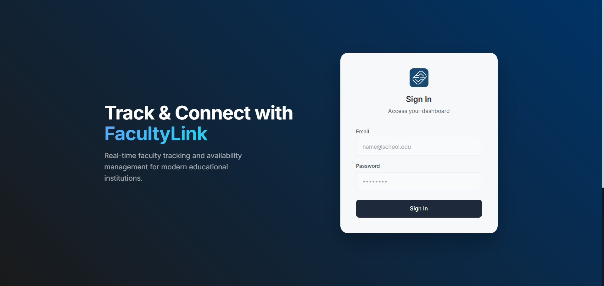

<div align="center">

# 

[](https://php.net/)
[](https://www.docker.com/)
[](https://www.mysql.com/)
[](https://leafletjs.com/)

A comprehensive **Teacher Tracking and Profiling System** designed to streamline campus monitoring and academic visibility. This AI-powered platform provides role-based dashboards for administrators, teachers, and students, facilitating real-time status updates and location monitoring while strictly adhering to privacy standards.

</div>

## Project Overview

**FacultyLink** (Teacher Tracking System) is a robust web application built with vanilla PHP and MySQL, fully containerized with Docker. It addresses the need for real-time faculty availability tracking within an educational institution.

The system enforces a **"Status-Only"** policy for students allowing them to see if a teacher is "Available", "In Class", or "Busy" while reserving precise **GPS location monitoring** exclusively for administrators via interactive Leaflet maps.



## Key Features

### Student Access

.png>)

- **Privacy-First Design**: View teacher status (e.g., Available, In Class) without exposing location data.
- **Search & Filter**: Quickly find teachers by name or department.
- **Real-Time Updates**: See the most recent status timestamps.

### Teacher Portal

.png>)

- **Status Management**: Update current availability (Available, In Class, Busy, Offline, Off Campus).
- **GPS Location Pings**: Securely submit current location using browser geolocation APIs.
- **Profile Management**: Maintain professional details and subject lists.

### Admin Console

.png>)

- **Interactive Map Monitor**: Visualize teacher locations in real-time using Leaflet maps.
- **Audit Logging**: Comprehensive logs of all privileged actions and location history.
- **User Management**: Full control over student and teacher accounts.
- **Analytics**: Generate reports on faculty attendance and availability history.

## Quick Start

###  With Docker (Recommended)

1. **Clone the repository**

   ```bash
   git clone https://github.com/frostjade71/teacher-tracking-and-profiling.git
   cd teacher-tracking-and-profiling
   ```

2. **Start the application**

   ```bash
   docker-compose up -d --build
   ```

3. **Access the System**
   - **Web Interface**: `http://localhost:8080`
   - **Database**: `http://localhost:3306` (or configured port)

> **Note**: Ensure Docker Desktop is running before executing the commands.

## Technology Stack

<p align="center">
  
</p>

- **Backend**: Vanilla PHP 8+ (No heavy frameworks)
- **Database**: MySQL 8.0
- **Frontend**: HTML5, Tailwind CSS, JavaScript
- **Mapping**: Leaflet.js (OpenStreetMap)
- **Infrastructure**: Docker & Docker Compose

## Configuration

### Database Environment

The system is pre-configured with Docker environment variables. You can verify them in `docker-compose.yml`:

```yaml
environment:
  DB_HOST: mysql
  DB_NAME: ttrack
  DB_USER: ttrack_user
  DB_PASS: ttrack_pass
```

### Security Features

- **Role-Based Access Control (RBAC)**: Strict permission checks for every request.
- **Password Hashing**: Industry-standard `bcrypt` encryption.
- **Prepared Statements**: Full protection against SQL injection attacks using PDO.
- **Session Security**: Session ID regeneration and secure cookie handling.

## Usage Guide

1. **Login**: Access the system with your assigned credentials.
2. **Dashboard**: automatically redirected to your role-specific dashboard (Student, Teacher, or Admin).
3. **Teachers**: Click "Update Location" to send a GPS ping.
4. **Admins**: Navigate to "Monitor" to view the live tracking map.

## Contributing

Contributions are welcome!

1. Fork the repository
2. Create a feature branch (`git checkout -b feature/NewFeature`)
3. Commit your changes (`git commit -m 'Add NewFeature'`)
4. Push to the branch (`git push origin feature/NewFeature`)
5. Open a Pull Request

## License

This project is licensed under the MIT License. See the [LICENSE](LICENSE) file for details.

---
