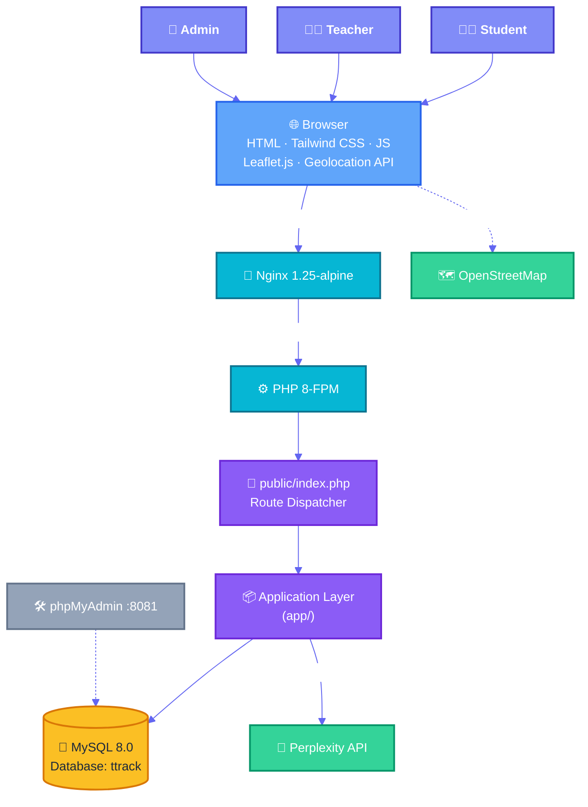
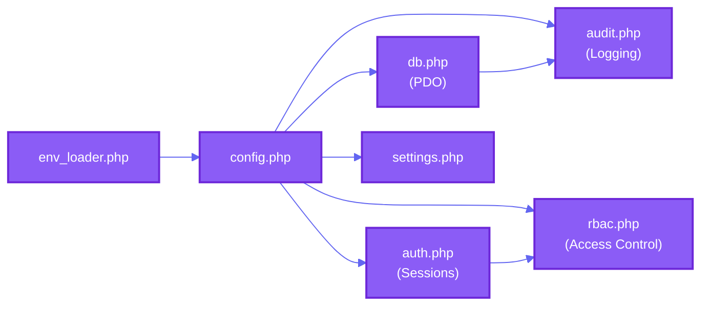
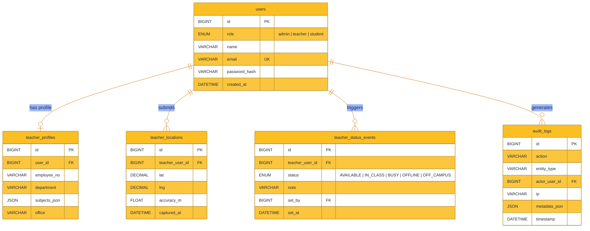
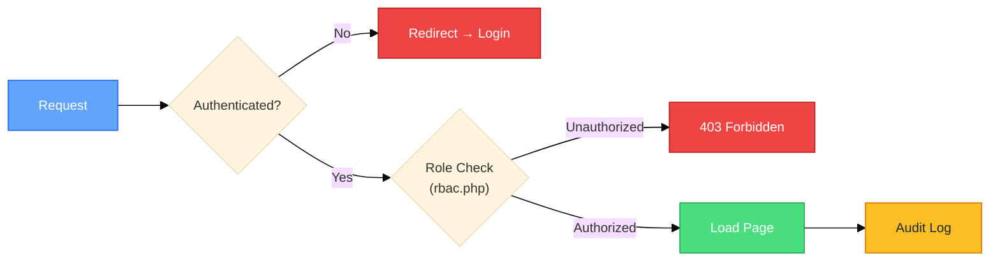
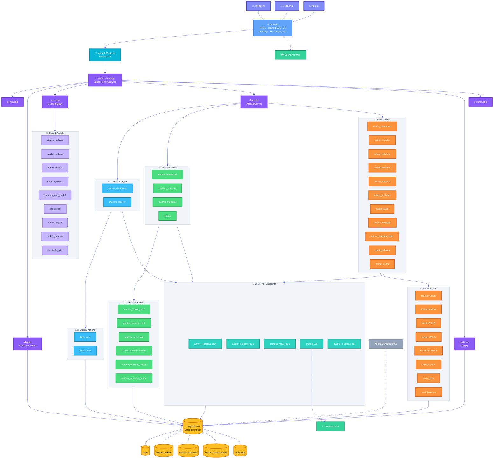

# System Architecture

> **AI‑Powered Teacher Tracking & Profile System** — Vanilla PHP 8 · MySQL 8 · Docker

---

## 1 · High‑Level Overview



---

## 2 · Infrastructure & Docker

The system runs as **four Docker containers** on a single bridge network (`ttrack-network`).

| Service | Image | Port | Role |
|---|---|---|---|
| **nginx** | `nginx:1.25-alpine` | `:8080 → :80` | Reverse proxy, serves static files, forwards PHP to FastCGI |
| **php** | Custom build (`docker/php/`) | `:9000` (internal) | PHP‑FPM application runtime |
| **mysql** | `mysql:8.0` | internal only | Persistent data store; seeded from `db/init.sql` |
| **phpmyadmin** | `phpmyadmin/phpmyadmin` | `:8081 → :80` | Database admin GUI (dev only) |

**Volume mounts:** `public/` and `app/` are mounted into both nginx (read‑only) and php containers. A named volume `dbdata` persists MySQL data. Environment variables (`DB_HOST`, `DB_NAME`, `DB_USER`, `DB_PASS`, `PERPLEXITY_API_KEY`) are injected from `.env`.

```
docker-compose.yml
├── nginx        → default.conf (docker/nginx/)
├── php          → Dockerfile   (docker/php/)
├── mysql        → init.sql     (db/)
└── phpmyadmin
```

---

## 3 · Application Architecture

### 3.1 · Request Lifecycle

```
Browser  ──HTTP──▸  Nginx  ──FastCGI──▸  PHP-FPM
                                            │
                                    public/index.php
                                       ├── loads .env
                                       ├── requires core modules
                                       ├── reads ?page= param
                                       ├── matches route whitelist
                                       └── requires page/action file
```

`public/index.php` is the **single entry point**. The `.htaccess` rewrites all requests to it. Routes are a whitelist array mapping `?page=` values to PHP files under `app/pages/` or `app/actions/`.

### 3.2 · Directory Structure

```
project-root/
│
├── public/                  # Web‑accessible document root
│   ├── index.php            # 📡 Single entry point & route dispatcher
│   ├── .htaccess            # URL rewrite rules
│   └── assets/
│       ├── app.css          # Global stylesheet (Tailwind compiled)
│       ├── toast.css        # Toast notification styles
│       ├── theme.js         # Dark/light mode toggle logic
│       ├── mobile.js        # Mobile responsive helpers
│       ├── loader.js        # Page loading animation
│       ├── map_arrows.js    # Map directional arrows for Leaflet
│       ├── toast.js         # Toast notification system
│       └── favicon/         # Favicon assets
│
├── app/                     # Application logic (NOT web‑accessible)
│   ├── config.php           # App constants & configuration
│   ├── db.php               # PDO database connection factory
│   ├── auth.php             # Session management & authentication
│   ├── rbac.php             # Role‑based access control
│   ├── audit.php            # Audit logging to database
│   ├── settings.php         # Dynamic settings loader
│   ├── setup_radar_table.php
│   │
│   ├── helpers/
│   │   ├── env_loader.php       # .env file parser
│   │   └── perplexity_helper.php # Perplexity AI API wrapper
│   │
│   ├── partials/            # Reusable UI fragments (included by pages)
│   │   ├── student_sidebar.php
│   │   ├── teacher_sidebar.php
│   │   ├── admin_sidebar.php
│   │   ├── student_mobile_header.php
│   │   ├── teacher_mobile_header.php
│   │   ├── admin_mobile_header.php
│   │   ├── chatbot_widget.php
│   │   ├── campus_map_modal.php
│   │   ├── info_modal.php
│   │   ├── teacher_timetable_grid.php
│   │   └── theme_toggle.php
│   │
│   ├── pages/               # Page controllers (render HTML)
│   │   └── (26 files — see §4)
│   │
│   └── actions/             # POST handlers & mutations
│       └── (27 files — see §5)
│
├── db/
│   └── init.sql             # Database schema + seed data
│
├── docker/
│   ├── nginx/default.conf   # Nginx server config
│   └── php/Dockerfile       # PHP‑FPM image build
│
├── docker-compose.yml
├── .env / .env.example
├── PRD.md                   # Product Requirements Document
└── README.md
```

### 3.3 · Core Module Dependency Flow



| Module | File | Responsibility |
|---|---|---|
| **Env Loader** | `helpers/env_loader.php` | Parses `.env` file into environment variables |
| **Config** | `config.php` | App‑wide constants, error reporting, timezone |
| **Database** | `db.php` | Singleton PDO connection with prepared statement helper |
| **Auth** | `auth.php` | `session_start()`, `current_user()`, `require_login()` |
| **RBAC** | `rbac.php` | `require_role()` — enforces `admin`, `teacher`, `student` |
| **Audit** | `audit.php` | Writes action logs to `audit_logs` table |
| **Settings** | `settings.php` | Dynamic key‑value settings from database |
| **Perplexity** | `helpers/perplexity_helper.php` | Wraps Perplexity AI API calls for the chatbot |

---

## 4 · Pages by Role

### 👨‍🎓 Student Pages

| Route (`?page=`) | File | Description |
|---|---|---|
| `student_dashboard` | `student_dashboard.php` | Overview with teacher statuses |
| `student_teacher` | `student_teacher.php` | Detailed teacher profile & location view |

### 👩‍🏫 Teacher Pages

| Route (`?page=`) | File | Description |
|---|---|---|
| `teacher_dashboard` | `teacher_dashboard.php` | Status controls, location sharing, notes |
| `teacher_subjects` | `teacher_subjects.php` | Manage assigned subjects |
| `teacher_timetable` | `teacher_timetable.php` | Weekly schedule management |
| `profile` | `profile.php` | Teacher profile editor |

### 🔑 Admin Pages

| Route (`?page=`) | File | Description |
|---|---|---|
| `admin_dashboard` | `admin_dashboard.php` | System overview & statistics |
| `admin_monitor` | `admin_monitor.php` | Real‑time teacher monitoring |
| `admin_teachers` | `admin_teachers.php` | Teacher CRUD management |
| `admin_teachers_view` | `admin_teachers_view.php` | Detailed teacher view |
| `admin_teacher_profile` | `admin_teacher_profile.php` | Admin view of teacher profile |
| `admin_students` | `admin_students.php` | Student CRUD management |
| `admin_admins` | `admin_admins.php` | Admin user management |
| `admin_users` | `admin_users.php` | Combined user management |
| `admin_subjects` | `admin_subjects.php` | Subject CRUD management |
| `admin_timetable` | `admin_timetable.php` | System‑wide timetable |
| `admin_analytics` | `admin_analytics.php` | Reports & data visualization |
| `admin_audit` | `admin_audit.php` | Audit log viewer |
| `admin_campus_radar` | `admin_campus_radar.php` | Campus geofence configuration |

### 🔌 JSON API Endpoints

| Route (`?page=`) | File | Returns |
|---|---|---|
| `admin_locations_json` | `admin_locations_json.php` | All teacher GPS data (admin) |
| `public_locations_json` | `public_locations_json.php` | Filtered teacher locations (student) |
| `campus_radar_json` | `campus_radar_json.php` | Campus geofence polygon |
| `chatbot_api` | `chatbot_api.php` | AI chatbot responses via Perplexity |
| `teacher_subjects_api` | `teacher_subjects_api.php` | Teacher subject list (JSON) |

---

## 5 · Actions (POST Handlers)

All actions process form submissions or AJAX calls, perform database mutations, and redirect back.

### Authentication

| Action | File |
|---|---|
| `login_post` | `login_post.php` |
| `logout_post` | `logout_post.php` |

### Teacher Actions

| Action | File | What it does |
|---|---|---|
| `teacher_status_post` | `teacher_status_post.php` | Set availability status |
| `teacher_location_post` | `teacher_location_post.php` | Submit GPS coordinates |
| `teacher_note_post` | `teacher_note_post.php` | Add/update status note |
| `teacher_session_update` | `teacher_session_update.php` | Update active session |
| `teacher_subjects_update` | `teacher_subjects_update.php` | Save subject assignments |
| `teacher_timetable_action` | `teacher_timetable_action.php` | CRUD timetable entries |

### Admin — Teacher Management

| Action | File |
|---|---|
| `admin_teacher_create` | `admin_teacher_create.php` |
| `admin_teacher_update` | `admin_teacher_update.php` |
| `admin_teacher_delete` | `admin_teacher_delete.php` |

### Admin — Student Management

| Action | File |
|---|---|
| `admin_student_create` | `admin_student_create.php` |
| `admin_student_update` | `admin_student_update.php` |
| `admin_student_delete` | `admin_student_delete.php` |

### Admin — Admin Management

| Action | File |
|---|---|
| `admin_admin_create` | `admin_admin_create.php` |
| `admin_admin_update` | `admin_admin_update.php` |
| `admin_admin_delete` | `admin_admin_delete.php` |

### Admin — Subject Management

| Action | File |
|---|---|
| `admin_subject_create` | `admin_subject_create.php` |
| `admin_subject_update` | `admin_subject_update.php` |
| `admin_subject_delete` | `admin_subject_delete.php` |

### Admin — System

| Action | File | What it does |
|---|---|---|
| `admin_timetable_action` | `admin_timetable_action.php` | Manage system timetable |
| `admin_settings_save` | `admin_settings_save.php` | Persist settings changes |
| `admin_save_radar` | `admin_save_radar.php` | Save campus geofence polygon |
| `admin_reset_locations` | `admin_reset_locations.php` | Purge all teacher location data |

### Utilities & Migrations

| Action | File |
|---|---|
| `auto_offline_helper` | `auto_offline_helper.php` |
| `log_map_view_post` | `log_map_view_post.php` |
| `migrate_timetables` | `migrate_timetables.php` |
| `migrate_time_labels` | `migrate_time_labels.php` |

---

## 6 · Database Schema



### Key Relationships

- **users → teacher_profiles**: 1:1 for teachers; stores employee info, department, office
- **users → teacher_locations**: 1:many; GPS pings with accuracy & timestamp
- **users → teacher_status_events**: 1:many; chronological status changes
- **users → audit_logs**: 1:many; every system action is logged with IP & metadata

---

## 7 · External Integrations

| Service | Usage | Called From |
|---|---|---|
| **Perplexity AI API** | Powers the student AI chatbot for teacher/schedule queries | `chatbot_api.php` via `perplexity_helper.php` |
| **OpenStreetMap / Leaflet.js** | Map tile rendering for campus & teacher location views | Browser‑side (client JS) |
| **Browser Geolocation API** | Captures teacher lat/lng coordinates | Browser‑side → `teacher_location_post.php` |

---

## 8 · Security Model



| Layer | Mechanism |
|---|---|
| **Authentication** | PHP sessions with ID regeneration on login |
| **Authorization** | RBAC via `require_role()` — three roles: `admin`, `teacher`, `student` |
| **Input Validation** | PDO prepared statements for all SQL queries |
| **Audit Trail** | Every mutation logged to `audit_logs` with actor, IP, and metadata |
| **Route Protection** | Whitelist‑only routing — unknown `?page=` values return 404 |

---

## 9 · Frontend Architecture

The frontend is **server‑rendered PHP** enhanced with client‑side JavaScript for interactivity.

| Technology | Purpose |
|---|---|
| **Tailwind CSS** | Utility‑first styling (compiled to `app.css`) |
| **Leaflet.js** | Interactive campus maps with teacher location markers |
| **Geolocation API** | GPS coordinate capture from the browser |
| **Toast System** | `toast.js` + `toast.css` for user notifications |
| **Theme Toggle** | `theme.js` — dark/light mode persistence |
| **Mobile Support** | `mobile.js` + per‑role mobile headers for responsive navigation |

### Shared Partials

Reusable UI components included across pages:

| Partial | Used By |
|---|---|
| `student_sidebar.php` | Student pages |
| `teacher_sidebar.php` | Teacher pages |
| `admin_sidebar.php` | Admin pages |
| `*_mobile_header.php` | Mobile responsive headers (per role) |
| `chatbot_widget.php` | Student pages (AI assistant) |
| `campus_map_modal.php` | Pages with map interaction |
| `info_modal.php` | Contextual info dialogs |
| `teacher_timetable_grid.php` | Timetable views |
| `theme_toggle.php` | All pages |

---

## 10 · Detailed Component Diagram

